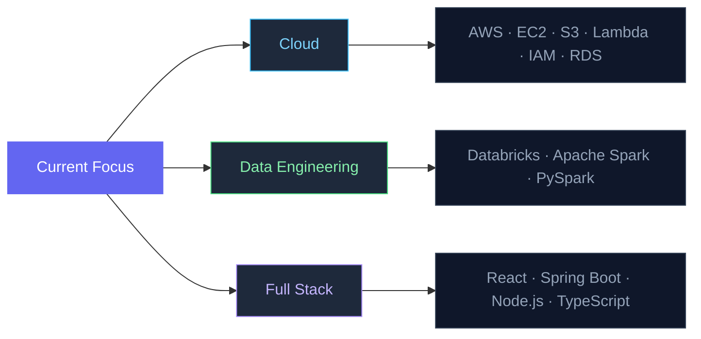

# Mauricio Ledezma

---

## 👋 About Me

Full-stack Software Engineer based in **San José, Costa Rica**, shipping complete web products from stakeholder meetings to live production. I build with **Java**, **Spring Boot**, **React**, and **TypeScript**. Curretly expanding into **cloud engineering** (AWS certified) and **data engineering** (Databricks).

- ☁️ **AWS Academy Cloud Foundations** certified · Studying Databricks & Apache Spark
- 🌐 Portfolio at **[mauledji.com](https://mauledji.com)**
- 🎓 B.Eng. Software Engineering @ Universidad Latina de Costa Rica (2023–2026)
- 📍 Open to Software Engineer, Cloud/DevOps & Data roles

---

## 🔨 What I Build

<table>
  <tr>
    <td valign="top" width="50%">
      <h3>🌐 Web Applications</h3>
      <ul>
        <li>React, Next.js & Astro frontends</li>
        <li>Spring Boot & Node.js backends</li>
        <li>RESTful APIs & Microservices</li>
        <li>Real-time systems with WebSockets</li>
      </ul>
    </td>
    <td valign="top" width="50%">
      <h3>☁️ Cloud & Infrastructure</h3>
      <ul>
        <li>AWS (EC2, S3, Lambda, VPC, IAM, RDS)</li>
        <li>Cloudflare deployment & CDN</li>
        <li>Linux server administration</li>
        <li>CI/CD pipelines</li>
      </ul>
    </td>
  </tr>
  <tr>
    <td valign="top" width="50%">
      <h3>⚙️ Backend & APIs</h3>
      <ul>
        <li>Java + Spring Boot production systems</li>
        <li>JWT authentication & Spring Security</li>
        <li>MySQL, PostgreSQL, MongoDB</li>
        <li>Concurrent & real-time architectures</li>
      </ul>
    </td>
    <td valign="top" width="50%">
      <h3>📊 Data Engineering</h3>
      <ul>
        <li>Apache Spark & PySpark</li>
        <li>Databricks platform</li>
        <li>ETL/ELT pipelines</li>
        <li>Data Warehousing (Redshift)</li>
      </ul>
    </td>
  </tr>
</table>

---

## 🛠️ Tech Stack

**Languages**

&nbsp;&nbsp;
&nbsp;&nbsp;
&nbsp;&nbsp;
&nbsp;&nbsp;
&nbsp;&nbsp;

  

**Frontend**

&nbsp;&nbsp;
&nbsp;&nbsp;
&nbsp;&nbsp;
&nbsp;&nbsp;
&nbsp;&nbsp;

  

**Backend & Databases**

&nbsp;&nbsp;
&nbsp;&nbsp;
&nbsp;&nbsp;
&nbsp;&nbsp;

  

**Cloud & Data**

&nbsp;&nbsp;
&nbsp;&nbsp;
&nbsp;&nbsp;
&nbsp;&nbsp;
&nbsp;&nbsp;
&nbsp;&nbsp;

  

**Tools**

&nbsp;&nbsp;
&nbsp;&nbsp;

---

## 🔭 Currently Exploring

---

## 📊 GitHub Stats

<picture>
  <source media="(prefers-color-scheme: dark)"
    srcset="https://github-readme-stats.vercel.app/api?username=Mauledji&show_icons=true&hide_border=true&bg_color=0d1117&title_color=6366f1&icon_color=6366f1&text_color=94a3b8&count_private=true" />
  <source media="(prefers-color-scheme: light)"
    srcset="https://github-readme-stats.vercel.app/api?username=Mauledji&show_icons=true&hide_border=true&title_color=6366f1&icon_color=6366f1&count_private=true" />
  
</picture>
&nbsp;
<picture>
  <source media="(prefers-color-scheme: dark)"
    srcset="https://github-readme-stats.vercel.app/api/top-langs/?username=Mauledji&layout=compact&hide_border=true&bg_color=0d1117&title_color=6366f1&text_color=94a3b8&langs_count=8" />
  <source media="(prefers-color-scheme: light)"
    srcset="https://github-readme-stats.vercel.app/api/top-langs/?username=Mauledji&layout=compact&hide_border=true&title_color=6366f1&langs_count=8" />
  
</picture>

---

## 🏅 Certifications

&nbsp;

---

  📍 San José, Costa Rica &nbsp;·&nbsp; Open to Software Engineer, Cloud & Data roles

